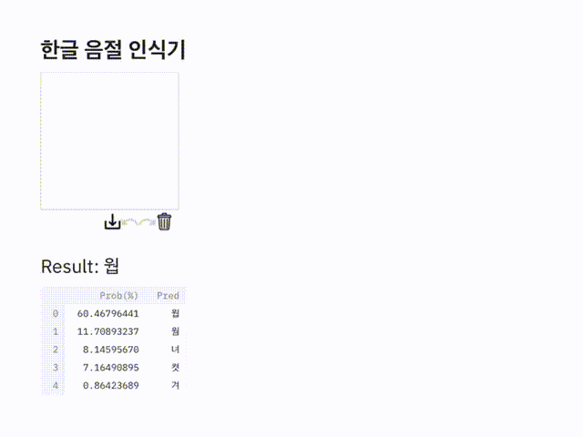
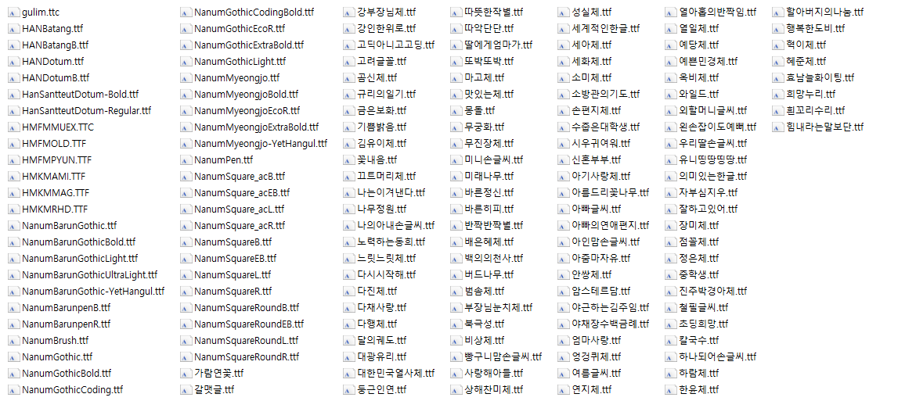
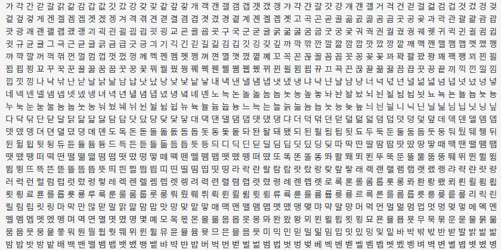
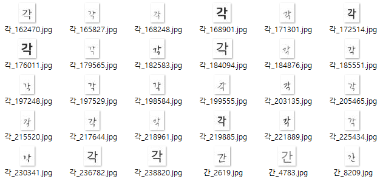
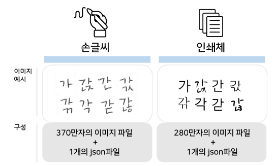
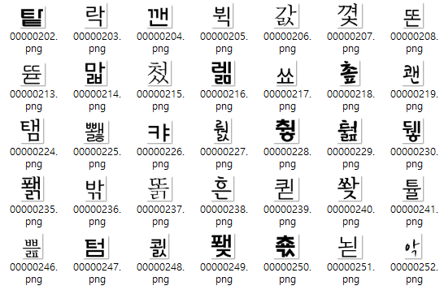
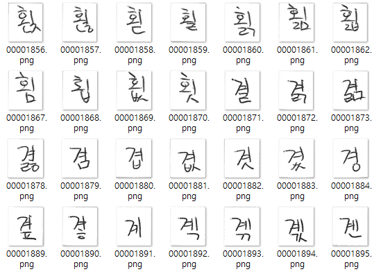
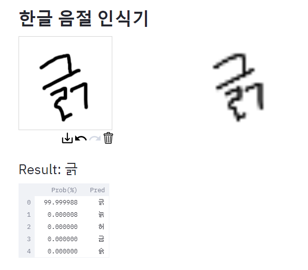

# hangul-syllable-recognition



## Introduction

한글은 조합이 다양하기 때문에 영어에 비해서 OCR 성능이 조금 떨어진다고 알고 있다. 

다양한 폰트와 손글씨 데이터를 가지고, 얼마나 한글을 잘 인식하는지 확인하기 위해서 프로젝트를 진행했다.

## Getting started

### python and pakage version

```
python3 == 3.8.3
tensorflow_gpu == 2.3.0
numpy == 1.19.5
argparse == 1.1
pandas == 1.2.0
cv2 == 4.5.1
streamlit == 0.74.1
streamlit_drawable_canvas
```


### Training Data

프로젝트를 위한 Data는 총 두 종류의 Data를 사용했다. 

TextRecognitionDataGenerator로 생성한 글자 이미지 100,000장과 AI Hub에서 제공하는 글자 이미지 404,474장을 사용했다.

#### TextRecognitionDataGenerator

Github : https://github.com/Belval/TextRecognitionDataGenerator

font파일과 생성할 글자들을 모은 txt파일이 있으면, 위의 TextRecognitionDataGenerator를 통해서 글자 이미지를 생성할 수 있다.

1. fonts/ko에 font 추가(.ttf파일)
- 생성에 사용된 font는 기본으로 사용되는 font와 네이버에서 제공되는 손씨 font이며, 그 목록은 다음과 같다.
    


2. dicts/ko에 학습용 글자 음절 추가(.txt파일)
- 사용되는 글자는 KS X 1001 완성형에 포함된 현대 한글 2350자를 사용하였다. 

http://asq.kr/gbm4hQYQ3TF1bY


- 데이터 생성 결과


#### AI Hub

Link : https://aihub.or.kr/aidata/133



AI Hub에서 현대 한글 11,172자를 가장 많이 활용하는 폰트 50종을 선정하여 학습용 이미지와 어노테이션을 제공한다. 또한, 손글씨도 제공하는데, 연령층별로 손글씨 작성인력을 확보해 직접 작성 제작한 손글씨 이미지와 어노테이션을 제공한다. 

- 인쇄체


- 손글씨

          

조합할 수 있는 모든 한글에 대한 이미지가 존재하기 때문에, 전처리 과정을 통해서 사용할 2,350자에 대한 이미지 경로만 추출하여서 학습에 사용했다.

### Model

Clova deep-text-recognition에서 사용한 VGG_Extractor의 구조를 참조하였다. (https://arxiv.org/pdf/1507.05717.pdf)

Github : https://github.com/clovaai/deep-text-recognition-benchmark


### Create dataset

Data는 이미지의 경로와 라벨을 csv파일에 저장하였고, csv파일을 읽어서 Train/Valid Dataset을 생성하였다.

Datatset 생성 과정에서 이미지의 크기를 32px x 32px로 resize하고, pixel값이 [0, 1]의 값을 갖도록 normalization을 적용해주었다. (dataset.py)

### Training and Validation

기본적으로 train.py를 실행하면 default 설정으로 학습이 진행된다. 

epochs, batch_size, 모델 weight save path, data파일 위치 등을 설정할 수 있다.

### Predict

test 이미지를 저장할 폴더를 test_data에 설정하고, 학습된 모델의 weight 저장 위치를 saved_model에 설정한다. test.py를 실행하면, 예측 결과를 프린트한다.

### Using streamlit

```
streamlit run webapp.py
```
위 명령어로 실행하면 Streamlit을 사용해서 웹앱으로 구현을 할 수 있다. 왼쪽 canvas에 글자를 쓰면, 오른쪽에 모델이 feeding되는 이미지가 나타나고, 예측을 시작한다.

예측 결과는 실시간으로 나타나며, 아래에 높은 확률을 가진 5개의 결과를 내림차순으로 보여준다.

steamlit은 아래 youtube를 참조하였다.

Link : http://asq.kr/DxUZf7Fgzmtmdq



## Result

약 98%의 training/validation accuracy로 학습을 완료했으며 이 과정에서 minimum loss는 0.04 였다.

테스트를 위해서 TextRecognitionDataGenerator로 새로운 글자 이미지 80,000개를 생성하여 테스트를 했을 때에는 약 80%의 accuracy를 달성했다.

결과만을 봤을 때에는 과적합이 발생했다고 생각이 되었지만, 실제 나의 손글씨로 테스트를 했을 때 꽤 높은 정확도를 보여주고 있다.(IPad를 통해서 테스트함)


